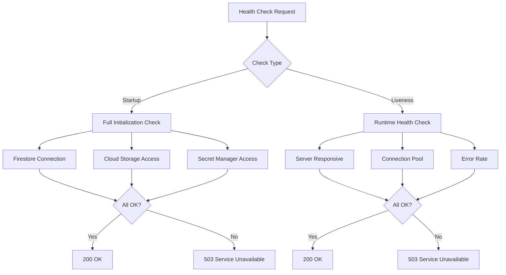

# Health Check Endpoints

The Boot Server exposes standard health check endpoints used by GCP Cloud Run for startup and liveness probes. These endpoints are unauthenticated and accessible without VPN access.

## Startup Probe

### `GET /health/startup`

Indicates whether the application has completed initialization and is ready to receive traffic.

**Request Example:**

```http
GET /health/startup HTTP/1.1
Host: boot.example.com
```

**Response (200 OK):**

```json
{
  "status": "ok",
  "timestamp": "2025-11-19T06:00:00Z",
  "checks": {
    "firestore": "connected",
    "cloud_storage": "connected",
    "secret_manager": "connected"
  }
}
```

**Response (503 Service Unavailable):**

```json
{
  "status": "unavailable",
  "timestamp": "2025-11-19T06:00:00Z",
  "checks": {
    "firestore": "connected",
    "cloud_storage": "error",
    "secret_manager": "connected"
  },
  "errors": [
    "Cloud Storage connection failed: permission denied"
  ]
}
```

**Response Headers:**

- `Content-Type: application/json`
- `Cache-Control: no-cache, no-store, must-revalidate`

**Startup Check Components:**

1. **Firestore Connection** - Verifies database connectivity
2. **Cloud Storage Access** - Validates access to boot image buckets
3. **Secret Manager** - Confirms access to configuration secrets (if applicable)

**Cloud Run Configuration:**

```yaml
livenessProbe:
  httpGet:
    path: /health/startup
    port: 8080
  initialDelaySeconds: 0
  timeoutSeconds: 30
  periodSeconds: 10
  failureThreshold: 3
```

**Behavior:**

- **Success (200)**: Application is fully initialized and ready to serve requests
- **Failure (503)**: Application is still starting up or encountered initialization errors
- **Timeout**: After 30 seconds of no response, Cloud Run considers startup failed

---

## Liveness Probe

### `GET /health/liveness`

Indicates whether the application is alive and healthy. Used by Cloud Run to detect and restart unhealthy instances.

**Request Example:**

```http
GET /health/liveness HTTP/1.1
Host: boot.example.com
```

**Response (200 OK):**

```json
{
  "status": "ok",
  "timestamp": "2025-11-19T06:00:00Z",
  "uptime_seconds": 3600
}
```

**Response (503 Service Unavailable):**

```json
{
  "status": "unhealthy",
  "timestamp": "2025-11-19T06:00:00Z",
  "uptime_seconds": 3650,
  "errors": [
    "Firestore connection pool exhausted",
    "High error rate in last 60 seconds: 45%"
  ]
}
```

**Response Headers:**

- `Content-Type: application/json`
- `Cache-Control: no-cache, no-store, must-revalidate`

**Liveness Check Components:**

1. **HTTP Server Health** - Verifies the HTTP server is responsive
2. **Database Connection Pool** - Ensures database connections are available
3. **Error Rate** - Checks if error rate is within acceptable thresholds
4. **Memory Pressure** - Monitors memory usage (optional)

**Cloud Run Configuration:**

```yaml
livenessProbe:
  httpGet:
    path: /health/liveness
    port: 8080
  initialDelaySeconds: 30
  timeoutSeconds: 30
  periodSeconds: 10
  failureThreshold: 3
```

**Behavior:**

- **Success (200)**: Application is healthy and functioning normally
- **Failure (503)**: Application is unhealthy and should be restarted
- **Consecutive Failures**: After 3 consecutive failures (30 seconds), Cloud Run restarts the instance

---

## Health Check Strategy

### Startup vs Liveness

| Aspect | Startup Probe | Liveness Probe |
|--------|---------------|----------------|
| **Purpose** | One-time initialization check | Ongoing health monitoring |
| **Frequency** | Every 10s during startup | Every 10s after startup |
| **Timeout** | 30 seconds | 30 seconds |
| **Failure Action** | Prevent traffic routing | Restart container |
| **Checks Performed** | Full dependency validation | Lightweight health checks |

### Graceful Degradation

The health checks are designed with graceful degradation in mind:

- **Critical Failures**: Return 503 and trigger restart (e.g., database connection lost)
- **Non-Critical Failures**: Log warnings but return 200 (e.g., temporary Cloud Storage timeout)
- **Transient Errors**: Retry internally before reporting failure

### Health Check Dependencies



---

## Observability

Health check results are logged and monitored:

**Metrics:**

- `health_check_total{probe="startup",status="ok"}` - Successful startup checks
- `health_check_total{probe="startup",status="error"}` - Failed startup checks
- `health_check_total{probe="liveness",status="ok"}` - Successful liveness checks
- `health_check_total{probe="liveness",status="error"}` - Failed liveness checks
- `health_check_duration_ms{probe="startup"}` - Startup check duration
- `health_check_duration_ms{probe="liveness"}` - Liveness check duration

**Structured Logs:**

```json
{
  "severity": "INFO",
  "timestamp": "2025-11-19T06:00:00Z",
  "message": "Health check completed",
  "probe": "liveness",
  "status": "ok",
  "duration_ms": 15,
  "checks": {
    "firestore": "connected",
    "cloud_storage": "connected"
  }
}
```

**Alerts:**

- **Startup Failure**: Alert if startup check fails for > 1 minute
- **Liveness Failure**: Alert if liveness check fails 3+ times consecutively
- **High Restart Rate**: Alert if container restarts > 3 times in 5 minutes

---

## Testing Health Checks

### Manual Testing

Test startup probe:
```bash
curl -v http://localhost:8080/health/startup
```

Test liveness probe:
```bash
curl -v http://localhost:8080/health/liveness
```

### Automated Testing

Health checks should be included in integration tests:

```go
func TestHealthStartup(t *testing.T) {
    resp, err := http.Get("http://localhost:8080/health/startup")
    require.NoError(t, err)
    defer resp.Body.Close()
    
    assert.Equal(t, http.StatusOK, resp.StatusCode)
    
    var health HealthResponse
    err = json.NewDecoder(resp.Body).Decode(&health)
    require.NoError(t, err)
    
    assert.Equal(t, "ok", health.Status)
    assert.NotEmpty(t, health.Timestamp)
}
```

### Load Testing

Health check endpoints should handle high request rates without degrading application performance:

- **Target**: 100 requests/second sustained
- **Timeout**: < 10ms average response time
- **Resource Impact**: < 1% CPU, < 10MB memory overhead

---

## Best Practices

1. **Keep Checks Fast**: Health checks should complete in < 100ms under normal conditions
2. **Avoid External Dependencies**: Don't make external API calls in health checks (use connection pool status instead)
3. **Use Circuit Breakers**: Implement circuit breakers for dependency checks to prevent cascading failures
4. **Log Check Failures**: Always log detailed information when health checks fail
5. **Test Failure Scenarios**: Regularly test health check behavior under failure conditions
6. **Monitor Check Duration**: Alert on health checks taking > 1 second (indicates performance issues)

---

## Troubleshooting

### Startup Check Never Succeeds

**Symptoms:**
- Container restarts repeatedly
- Cloud Run shows "unhealthy" status
- Startup probe returns 503

**Debugging:**
```bash
# Check Cloud Run logs for startup errors
gcloud logging read "resource.type=cloud_run_revision AND labels.service_name=boot-server" \
  --limit 50 --format json | jq '.[] | select(.jsonPayload.probe=="startup")'

# Test locally with debug logging
DEBUG=true go run main.go
```

**Common Causes:**
- Firestore credentials not configured
- Cloud Storage bucket permissions missing
- Network connectivity issues
- Timeout too short for slow dependencies

### Liveness Check Intermittent Failures

**Symptoms:**
- Occasional container restarts
- Liveness probe returns 503 sporadically
- High request latency

**Debugging:**
```bash
# Check error rate in last 5 minutes
gcloud monitoring time-series list \
  --filter='metric.type="custom.googleapis.com/health_check_total" AND metric.labels.status="error"' \
  --interval-start-time="5 minutes ago"

# Check for resource exhaustion
kubectl top pods -l app=boot-server
```

**Common Causes:**
- Database connection pool exhausted
- Memory pressure triggering GC pauses
- High request volume overwhelming server
- Dependency timeouts

---

## Security Considerations

### Unauthenticated Access

Health check endpoints are **intentionally unauthenticated** to allow Cloud Run infrastructure to probe without credentials. This is safe because:

1. Endpoints expose minimal information (status only)
2. No sensitive data is returned
3. Rate limiting prevents abuse
4. Endpoints are read-only

### Information Disclosure

Health checks should avoid disclosing:

- Internal IP addresses
- Detailed error messages with stack traces
- Database connection strings
- API keys or secrets

Return generic error messages in production:

```json
{
  "status": "unhealthy",
  "errors": ["Internal service error"]
}
```

Detailed diagnostics should be logged (not returned in response):

```json
{
  "severity": "ERROR",
  "message": "Firestore connection failed",
  "error": "rpc error: code = PermissionDenied desc = Missing or insufficient permissions"
}
```
