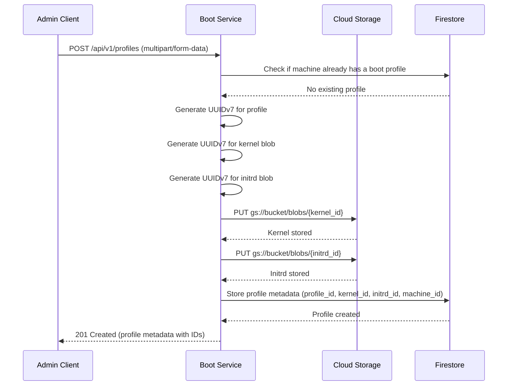

Create a new boot profile for a machine. If the machine already has a boot profile, this operation will fail - use PUT to update instead.

## Cloud Storage Structure

Kernel and initrd binaries are stored in Google Cloud Storage using their UUIDv7 identifiers as object keys:

```
gs://{bucket}/blobs/{kernel_id}
gs://{bucket}/blobs/{initrd_id}
```

For example:
```
gs://boot-server-blobs/blobs/018c7dbd-b100-7000-8000-123456789abc
gs://boot-server-blobs/blobs/018c7dbd-b200-7000-8000-987654321fed
```

The UUIDv7 identifiers are generated server-side during upload, ensuring:
- Globally unique object keys
- Time-ordered storage (UUIDv7 timestamp prefix)
- No namespace collisions between profiles

## Sequence Diagram



## Request

**Request Body (multipart/form-data):**

Form fields:
- `machine_id` (text): Machine identifier (UUIDv7)
- `kernel` (file): Kernel image file
- `initrd` (file): Initrd image file
- `kernel_args` (JSON array): Kernel command-line arguments

**Example Request:**

```http
POST /api/v1/profiles HTTP/1.1
Host: boot.example.com
Content-Type: multipart/form-data; boundary=----WebKitFormBoundary7MA4YWxkTrZu0gW

------WebKitFormBoundary7MA4YWxkTrZu0gW
Content-Disposition: form-data; name="machine_id"

018c7dbd-c000-7000-8000-fedcba987654
------WebKitFormBoundary7MA4YWxkTrZu0gW
Content-Disposition: form-data; name="kernel"; filename="vmlinuz"
Content-Type: application/octet-stream

<kernel binary data>
------WebKitFormBoundary7MA4YWxkTrZu0gW
Content-Disposition: form-data; name="initrd"; filename="initrd.img"
Content-Type: application/octet-stream

<initrd binary data>
------WebKitFormBoundary7MA4YWxkTrZu0gW
Content-Disposition: form-data; name="kernel_args"
Content-Type: application/json

["console=tty0", "console=ttyS0", "ip=dhcp"]
------WebKitFormBoundary7MA4YWxkTrZu0gW--
```

**Request Headers:**

- `Content-Type: multipart/form-data`

## Response

**Response (201 Created):**

```json
{
  "id": "018c7dbd-a000-7000-8000-abcdef123456",
  "machine_id": "018c7dbd-c000-7000-8000-fedcba987654",
  "kernel": {
    "id": "018c7dbd-b100-7000-8000-123456789abc",
    "args": ["console=tty0", "console=ttyS0", "ip=dhcp"]
  },
  "initrd": {
    "id": "018c7dbd-b200-7000-8000-987654321fed"
  }
}
```

**Error Responses:**

| Status Code | Description |
|-------------|-------------|
| 400 Bad Request | Invalid request body or missing required fields |
| 409 Conflict | Machine already has a boot profile (use PUT to update) |
| 422 Unprocessable Entity | Validation error (file too large, invalid JSON, machine_id not found) |

## Data Models

All data models are defined as Protocol Buffer (protobuf) messages and stored in Firestore.

### Boot Profile

```protobuf
syntax = "proto3";

message Kernel {
  string id = 1;              // UUIDv7 blob identifier
  repeated string args = 2;   // Kernel command-line arguments
}

message Initrd {
  string id = 1;              // UUIDv7 blob identifier
}

message BootProfile {
  string id = 1;              // UUIDv7 identifier
  string machine_id = 2;      // Reference to machine (UUIDv7) - unique constraint
  Kernel kernel = 3;          // Kernel configuration
  Initrd initrd = 4;          // Initrd configuration
}
```

**Note**: The `machine_id` field has a unique constraint in Firestore, ensuring each machine has exactly one active boot profile.
