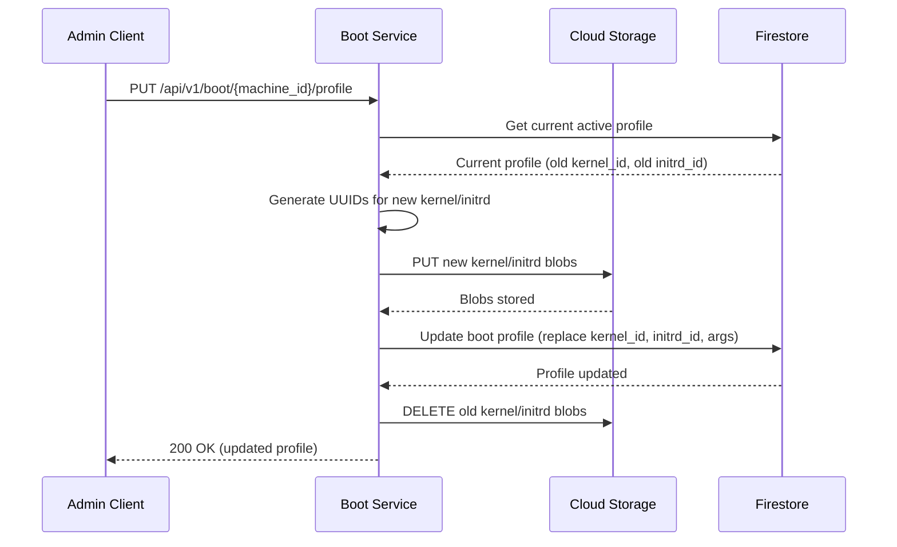

Update the boot profile for a machine (replaces the existing profile).

## Sequence Diagram



## Request

**Path Parameters:**

| Parameter | Type | Required | Description |
|-----------|------|----------|-------------|
| `machine_id` | string | Yes | Machine identifier (UUIDv7 format) |

**Request Body (multipart/form-data):**

Form fields:
- `kernel` (file): Kernel image file
- `initrd` (file): Initrd image file
- `kernel_args` (JSON array): Kernel command-line arguments

**Example Request:**

```http
PUT /api/v1/boot/018c7dbd-c000-7000-8000-fedcba987654/profile HTTP/1.1
Host: boot.example.com
Content-Type: multipart/form-data; boundary=----WebKitFormBoundary7MA4YWxkTrZu0gW

------WebKitFormBoundary7MA4YWxkTrZu0gW
Content-Disposition: form-data; name="kernel"; filename="vmlinuz"
Content-Type: application/octet-stream

<kernel binary data>
------WebKitFormBoundary7MA4YWxkTrZu0gW
Content-Disposition: form-data; name="initrd"; filename="initrd.img"
Content-Type: application/octet-stream

<initrd binary data>
------WebKitFormBoundary7MA4YWxkTrZu0gW
Content-Disposition: form-data; name="kernel_args"
Content-Type: application/json

["console=tty0", "console=ttyS0", "ip=dhcp"]
------WebKitFormBoundary7MA4YWxkTrZu0gW--
```

## Response

**Response (200 OK):**

```json
{
  "id": "018c7dbd-a000-7000-8000-abcdef123456",
  "machine_id": "018c7dbd-c000-7000-8000-fedcba987654",
  "kernel": {
    "id": "018c7dbd-b100-7000-8000-123456789abc",
    "args": ["console=tty0", "console=ttyS0", "ip=dhcp"]
  },
  "initrd": {
    "id": "018c7dbd-b200-7000-8000-987654321fed"
  }
}
```

**Error Responses:**

All error responses follow RFC 7807 Problem Details format (see [ADR-0007](../../adrs/0007-standard-api-error-response/)) with `Content-Type: application/problem+json`.

**404 Not Found** - Machine not found or has no boot profile:

```json
{
  "type": "https://api.example.com/errors/boot-profile-not-found",
  "title": "Boot Profile Not Found",
  "status": 404,
  "detail": "No boot profile found for machine 018c7dbd-c000-7000-8000-fedcba987654",
  "instance": "/api/v1/boot/018c7dbd-c000-7000-8000-fedcba987654/profile",
  "machine_id": "018c7dbd-c000-7000-8000-fedcba987654"
}
```

**422 Unprocessable Entity** - Validation error:

```json
{
  "type": "https://api.example.com/errors/file-too-large",
  "title": "File Too Large",
  "status": 422,
  "detail": "Kernel file exceeds maximum allowed size of 100MB",
  "instance": "/api/v1/boot/018c7dbd-c000-7000-8000-fedcba987654/profile",
  "field": "kernel",
  "file_size": 125829120,
  "max_size": 104857600
}
```
