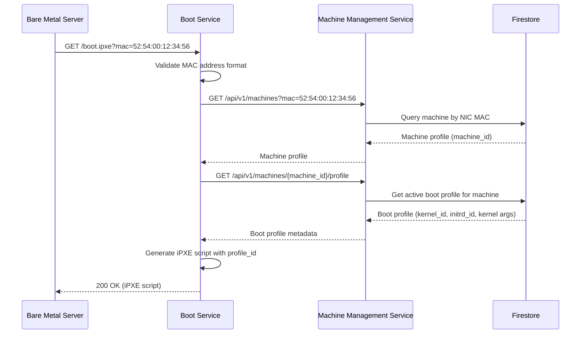
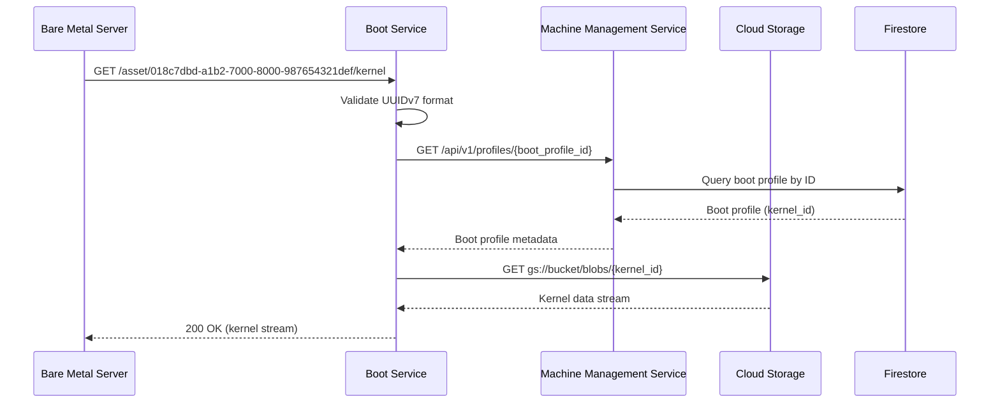
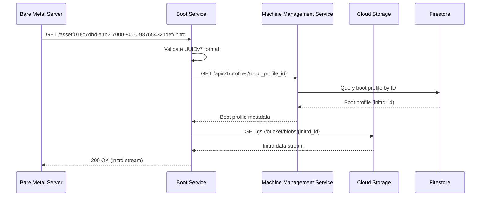

These endpoints are accessed by bare metal servers (HP DL360 Gen 9) during the UEFI HTTP boot process. All endpoints are accessed through the WireGuard VPN tunnel and use source IP validation for security.

## Boot Script Endpoint

### `GET /boot.ipxe`

Serves iPXE boot scripts customized for the requesting machine based on its MAC address.

#### Sequence Diagram



**Query Parameters:**

| Parameter | Type | Required | Description |
|-----------|------|----------|-------------|
| `mac` | string | Yes | MAC address of the requesting machine (format: `aa:bb:cc:dd:ee:ff`) |

**Request Example:**

```http
GET /boot.ipxe?mac=52:54:00:12:34:56 HTTP/1.1
Host: boot.internal
```

**Response Example (200 OK):**

```text
#!ipxe

# Boot configuration for node-01 (52:54:00:12:34:56)
# Boot Profile ID: 018c7dbd-a1b2-7000-8000-987654321def
# Generated: 2025-11-19T06:00:00Z

kernel /asset/018c7dbd-a1b2-7000-8000-987654321def/kernel console=tty0 console=ttyS0 ip=dhcp
initrd /asset/018c7dbd-a1b2-7000-8000-987654321def/initrd
boot
```

**Response Headers:**

- `Content-Type: text/plain; charset=utf-8`
- `Cache-Control: no-cache, no-store, must-revalidate`

**Error Responses:**

| Status Code | Description | Example |
|-------------|-------------|---------|
| 400 Bad Request | Missing or invalid MAC address | `{"error": {"code": "INVALID_MAC_ADDRESS", "message": "MAC address must be in format aa:bb:cc:dd:ee:ff"}}` |
| 404 Not Found | No boot configuration found for MAC | `{"error": {"code": "MACHINE_NOT_CONFIGURED", "message": "No boot configuration found for MAC 52:54:00:12:34:56"}}` |
| 500 Internal Server Error | Database or template error | `{"error": {"code": "INTERNAL_ERROR", "message": "Failed to generate boot script"}}` |

**Boot Script Variables:**

The iPXE script may include the following dynamic values:

- Machine-specific kernel parameters
- Asset download URLs (using URN format)
- Network configuration parameters

---

## Kernel Image Endpoint

### `GET /asset/{boot_profile_id}/kernel`

Streams kernel images from Cloud Storage for the boot process.

#### Sequence Diagram



**Path Parameters:**

| Parameter | Type | Required | Description |
|-----------|------|----------|-------------|
| `boot_profile_id` | string (UUIDv7) | Yes | Boot profile identifier (UUIDv7 format: `018c7dbd-a1b2-7000-8000-987654321def`) |

**Request Example:**

```http
GET /asset/018c7dbd-a1b2-7000-8000-987654321def/kernel HTTP/1.1
Host: boot.internal
```

**Response Example (200 OK):**

Binary kernel image streamed from Cloud Storage.

**Response Headers:**

- `Content-Type: application/octet-stream`
- `Content-Length: 8388608` (actual kernel size in bytes)
- `Cache-Control: public, max-age=3600`
- `ETag: "abc123..."`

**Error Responses:**

| Status Code | Description | Example |
|-------------|-------------|---------|
| 404 Not Found | Kernel image not found | `{"error": {"code": "KERNEL_NOT_FOUND", "message": "Kernel image 'ubuntu-2204' not found"}}` |
| 500 Internal Server Error | Cloud Storage error | `{"error": {"code": "STORAGE_ERROR", "message": "Failed to retrieve kernel from storage"}}` |

**Performance Characteristics:**

- **Streaming**: File is streamed directly from Cloud Storage (no buffering in memory)
- **Target Latency**: < 100ms to first byte
- **Typical Size**: 8-15 MB for Linux kernels

---

## Initrd Image Endpoint

### `GET /asset/{boot_profile_id}/initrd`

Streams initial ramdisk (initrd) images from Cloud Storage for the boot process.

#### Sequence Diagram



**Path Parameters:**

| Parameter | Type | Required | Description |
|-----------|------|----------|-------------|
| `boot_profile_id` | string (UUIDv7) | Yes | Boot profile identifier (UUIDv7 format: `018c7dbd-a1b2-7000-8000-987654321def`) |

**Request Example:**

```http
GET /asset/018c7dbd-a1b2-7000-8000-987654321def/initrd HTTP/1.1
Host: boot.internal
```

**Response Example (200 OK):**

Binary initrd image streamed from Cloud Storage.

**Response Headers:**

- `Content-Type: application/octet-stream`
- `Content-Length: 52428800` (actual initrd size in bytes)
- `Cache-Control: public, max-age=3600`
- `ETag: "def456..."`

**Error Responses:**

| Status Code | Description | Example |
|-------------|-------------|---------|
| 404 Not Found | Initrd image not found | `{"error": {"code": "INITRD_NOT_FOUND", "message": "Initrd image 'ubuntu-2204' not found"}}` |
| 500 Internal Server Error | Cloud Storage error | `{"error": {"code": "STORAGE_ERROR", "message": "Failed to retrieve initrd from storage"}}` |

**Performance Characteristics:**

- **Streaming**: File is streamed directly from Cloud Storage (no buffering in memory)
- **Target Latency**: < 100ms to first byte
- **Typical Size**: 50-150 MB for Linux initrd images

---

## Security Considerations

### VPN Source IP Validation

All boot endpoints validate that requests originate from the WireGuard VPN subnet:

- **Allowed CIDR**: `10.x.x.0/24` (WireGuard VPN network)
- **Validation**: Performed at Cloud Run ingress or application layer
- **Rejection**: Requests from outside VPN return `403 Forbidden`

### Rate Limiting

To prevent abuse, boot endpoints are rate-limited:

- **Boot Script**: 10 requests/minute per MAC address
- **Asset Downloads**: 5 concurrent downloads per MAC address

### Asset Integrity

Boot assets are validated for integrity:

- **Checksums**: SHA-256 checksums stored in Firestore
- **Verification**: Computed on upload, verified on download (optional)
- **ETag Headers**: Enable client-side caching and integrity checks

## Observability

All boot endpoint requests are instrumented with OpenTelemetry following HTTP semantic conventions:

- **Metrics**: OpenTelemetry HTTP server metrics (request count, duration, size)
  - `http.server.request.duration` - Request duration histogram
  - `http.server.request.body.size` - Request body size
  - `http.server.response.body.size` - Response body size (tracks bytes transferred)
- **Traces**: End-to-end tracing from request to Cloud Storage retrieval
  - HTTP server span captures request details (method, route, status code)
  - Child spans for database queries and Cloud Storage operations
- **Logs**: Structured logs with MAC address, image ID, response status
