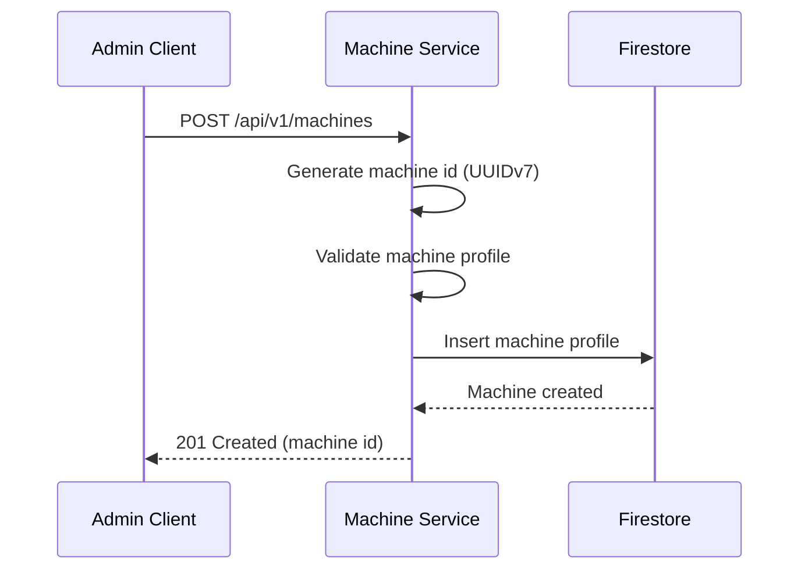
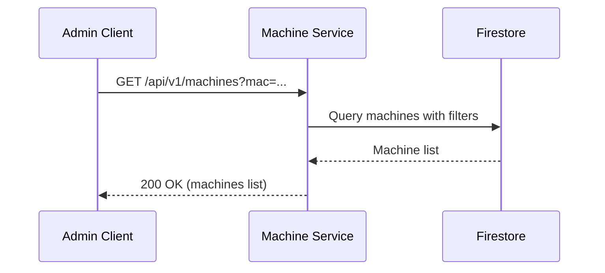
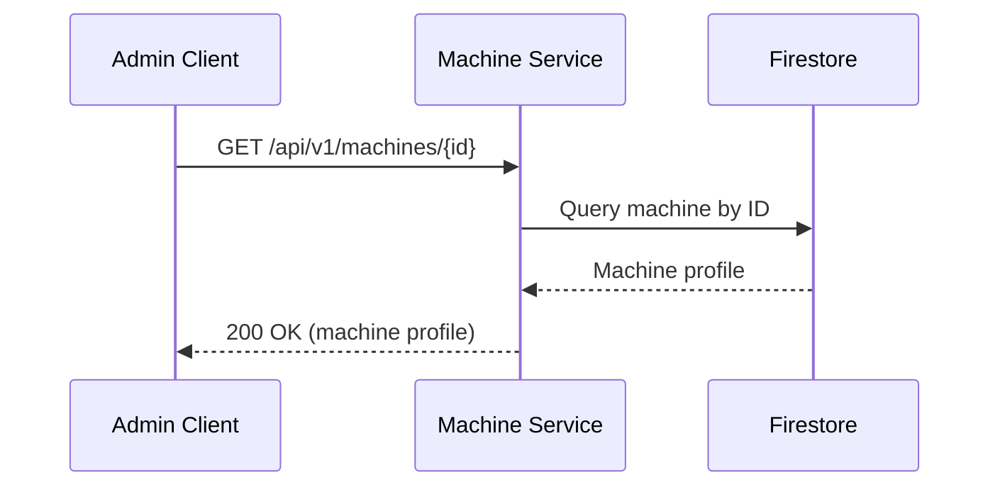
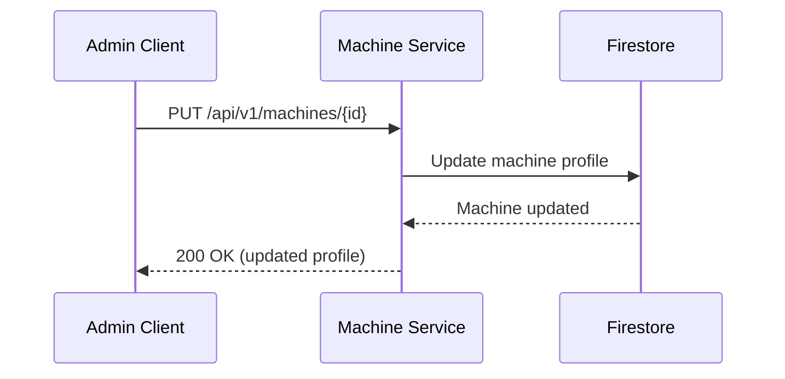
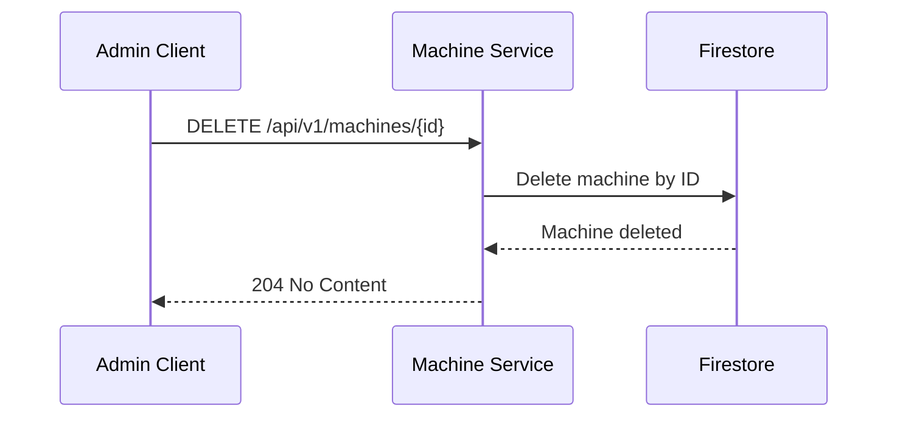

The Machine Service provides HTTP REST endpoints for managing machine hardware profiles. This service stores machine specifications (CPUs, memory, NICs, drives, accelerators) in Firestore and is queried by the Boot Service during boot operations and by administrators for configuration management.

## Machine Hardware Profiles

Machine profiles define the physical hardware specifications of bare metal servers. Each machine is uniquely identified by its NICs' MAC addresses.

## Machine Management

### `POST /api/v1/machines`

Register a new machine with hardware specifications.

#### Sequence Diagram



**Request Body:**

```json
{
  "cpus": [
    {
      "manufacturer": "Intel",
      "clock_frequency": 2400000000,
      "cores": 8
    }
  ],
  "memory_modules": [
    {
      "size": 17179869184
    },
    {
      "size": 17179869184
    }
  ],
  "accelerators": [],
  "nics": [
    {
      "mac": "52:54:00:12:34:56"
    }
  ],
  "drives": [
    {
      "capacity": 500107862016
    }
  ]
}
```

**Response (201 Created):**

```json
{
  "id": "018c7dbd-c000-7000-8000-fedcba987654",
  "cpus": [
    {
      "manufacturer": "Intel",
      "clock_frequency": 2400000000,
      "cores": 8
    }
  ],
  "memory_modules": [
    {
      "size": 17179869184
    },
    {
      "size": 17179869184
    }
  ],
  "accelerators": [],
  "nics": [
    {
      "mac": "52:54:00:12:34:56"
    }
  ],
  "drives": [
    {
      "capacity": 500107862016
    }
  ]
}
```

**Error Responses:**

| Status Code | Description |
|-------------|-------------|
| 400 Bad Request | Invalid request body or missing required fields |
| 409 Conflict | Machine with the same NIC MAC address already exists |

**Notes:**

- The machine ID is generated server-side (UUIDv7)
- MAC addresses must be unique across all machines
- All size/capacity values are in bytes
- Clock frequency is in hertz

---

### `GET /api/v1/machines`

List all registered machines.

#### Sequence Diagram



**Query Parameters:**

| Parameter | Type | Required | Description | Default |
|-----------|------|----------|-------------|---------|
| `page` | integer | No | Page number (1-indexed) | 1 |
| `per_page` | integer | No | Results per page (1-100) | 20 |
| `mac` | string | No | Filter by NIC MAC address | - |

**Response (200 OK):**

```json
{
  "machines": [
    {
      "id": "018c7dbd-c000-7000-8000-fedcba987654",
      "cpus": [
        {
          "manufacturer": "Intel",
          "clock_frequency": 2400000000,
          "cores": 8
        }
      ],
      "memory_modules": [
        {
          "size": 17179869184
        }
      ],
      "accelerators": [],
      "nics": [
        {
          "mac": "52:54:00:12:34:56"
        }
      ],
      "drives": [
        {
          "capacity": 500107862016
        }
      ]
    }
  ],
  "pagination": {
    "total": 1,
    "page": 1,
    "per_page": 20,
    "total_pages": 1
  }
}
```

---

### `GET /api/v1/machines/{id}`

Retrieve a specific machine by ID.

#### Sequence Diagram



**Path Parameters:**

| Parameter | Type | Required | Description |
|-----------|------|----------|-------------|
| `id` | string | Yes | Machine identifier (UUIDv7 format) |

**Response (200 OK):**

Same as POST response.

**Error Responses:**

| Status Code | Description |
|-------------|-------------|
| 404 Not Found | Machine with specified ID not found |

---

### `PUT /api/v1/machines/{id}`

Update a machine's hardware profile.

#### Sequence Diagram



**Path Parameters:**

| Parameter | Type | Required | Description |
|-----------|------|----------|-------------|
| `id` | string | Yes | Machine identifier (UUIDv7 format) |

**Request Body:**

Full machine profile (same as POST request).

**Response (200 OK):**

Full machine profile with updated fields.

**Error Responses:**

| Status Code | Description |
|-------------|-------------|
| 404 Not Found | Machine with specified ID not found |
| 400 Bad Request | Invalid request body |

---

### `DELETE /api/v1/machines/{id}`

Delete a machine registration.

#### Sequence Diagram



**Path Parameters:**

| Parameter | Type | Required | Description |
|-----------|------|----------|-------------|
| `id` | string | Yes | Machine identifier (UUIDv7 format) |

**Response (204 No Content):**

Empty response body.

**Error Responses:**

| Status Code | Description |
|-------------|-------------|
| 404 Not Found | Machine with specified ID not found |

---

## Data Models

The Machine Service only manages machine hardware profiles. All data models are defined as Protocol Buffer (protobuf) messages and stored in Firestore.

### Machine

```protobuf
syntax = "proto3";

message CPU {
  string manufacturer = 1;
  int64 clock_frequency = 2;  // measured in hertz
  int64 cores = 3;            // number of cores
}

message MemoryModule {
  int64 size = 1;             // measured in bytes
}

message Accelerator {
  string manufacturer = 1;
}

message NIC {
  string mac = 1;             // mac address
}

message Drive {
  int64 capacity = 1;         // capacity in bytes
}

message Machine {
  string id = 1;              // UUIDv7 machine identifier
  repeated CPU cpus = 2;
  repeated MemoryModule memory_modules = 3;
  repeated Accelerator accelerators = 4;
  repeated NIC nics = 5;
  repeated Drive drives = 6;
}
```

---

## Rate Limiting

Admin API endpoints are rate-limited to prevent abuse:

- **Per User/Service Account**: 100 requests/minute
- **Per IP Address**: 300 requests/minute
- **Global**: 1000 requests/minute

Rate limit headers are included in responses:

```
X-RateLimit-Limit: 100
X-RateLimit-Remaining: 95
X-RateLimit-Reset: 1700000000
```

When rate limit is exceeded, API returns `429 Too Many Requests`:

```json
{
  "error": {
    "code": "RATE_LIMIT_EXCEEDED",
    "message": "Rate limit exceeded. Try again in 30 seconds.",
    "details": {
      "retry_after": 30
    }
  }
}
```

---

## Versioning

The Admin API uses URL versioning (`/api/v1/`):

- **Current Version**: v1
- **Deprecation Policy**: Minimum 6 months notice before version deprecation
- **Version Header**: `X-API-Version: v1` included in all responses
