The Machine Management Service provides HTTP REST endpoints for managing machine hardware profiles and boot profiles. This service is called by the Boot Service during boot operations and by administrators for configuration management. Since this is for a home lab environment, no authentication is required.

## Boot Profile Management

Boot profiles bundle kernel, initrd, and kernel arguments together. Each profile is associated with a specific machine and its version. Profiles can be updated, creating new versions while maintaining the association with the machine.

## Cloud Storage Structure

Kernel and initrd binaries are stored in Google Cloud Storage using their UUIDv7 identifiers as object keys:

```
gs://{bucket}/blobs/{kernel_id}
gs://{bucket}/blobs/{initrd_id}
```

For example:
```
gs://boot-server-blobs/blobs/018c7dbd-b100-7000-8000-123456789abc
gs://boot-server-blobs/blobs/018c7dbd-b200-7000-8000-987654321fed
```

The UUIDv7 identifiers are generated server-side during upload, ensuring:
- Globally unique object keys
- Time-ordered storage (UUIDv7 timestamp prefix)
- No namespace collisions between profiles

### `POST /api/v1/profiles`

Create a new boot profile by uploading kernel, initrd, and configuration. The profile is associated with a specific machine ID and version.

#### Sequence Diagram

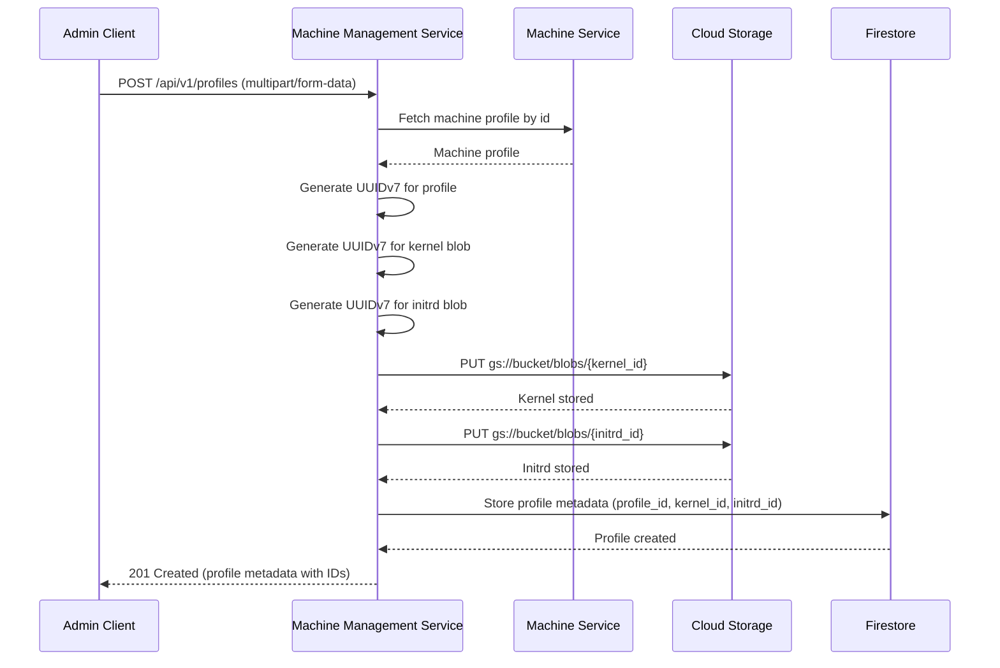

**Request Body (multipart/form-data):**

Form fields:
- `machine_id` (text): Machine identifier (UUIDv7)
- `kernel` (file): Kernel image file
- `initrd` (file): Initrd image file
- `kernel_args` (JSON array): Kernel command-line arguments

**Example Request:**

```http
POST /api/v1/profiles HTTP/1.1
Host: boot.example.com
Content-Type: multipart/form-data; boundary=----WebKitFormBoundary7MA4YWxkTrZu0gW

------WebKitFormBoundary7MA4YWxkTrZu0gW
Content-Disposition: form-data; name="machine_id"

018c7dbd-c000-7000-8000-fedcba987654
------WebKitFormBoundary7MA4YWxkTrZu0gW
Content-Disposition: form-data; name="kernel"; filename="vmlinuz"
Content-Type: application/octet-stream

<kernel binary data>
------WebKitFormBoundary7MA4YWxkTrZu0gW
Content-Disposition: form-data; name="initrd"; filename="initrd.img"
Content-Type: application/octet-stream

<initrd binary data>
------WebKitFormBoundary7MA4YWxkTrZu0gW
Content-Disposition: form-data; name="kernel_args"
Content-Type: application/json

["console=tty0", "console=ttyS0", "ip=dhcp"]
------WebKitFormBoundary7MA4YWxkTrZu0gW--
```

**Request Headers:**

- `Content-Type: multipart/form-data`

**Response (201 Created):**

```json
{
  "id": "018c7dbd-a000-7000-8000-abcdef123456",
  "kernel": {
    "id": "018c7dbd-b100-7000-8000-123456789abc",
    "args": ["console=tty0", "console=ttyS0", "ip=dhcp"]
  },
  "initrd": {
    "id": "018c7dbd-b200-7000-8000-987654321fed"
  }
}
```

**Error Responses:**

| Status Code | Description |
|-------------|-------------|
| 400 Bad Request | Invalid request body or missing required fields |
| 422 Unprocessable Entity | Validation error (file too large, invalid JSON, machine_id not found) |

---

### `GET /api/v1/profiles`

List all boot profiles.

#### Sequence Diagram

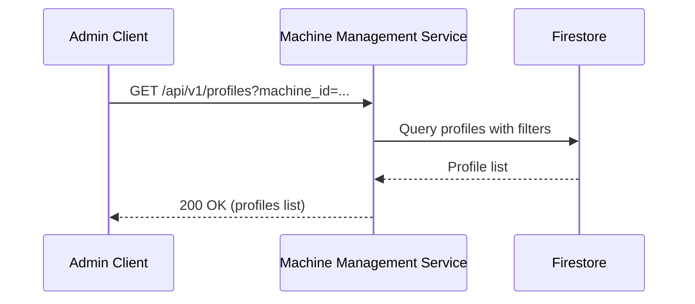

**Query Parameters:**

| Parameter | Type | Required | Description | Default |
|-----------|------|----------|-------------|---------|
| `page` | integer | No | Page number (1-indexed) | 1 |
| `per_page` | integer | No | Results per page (1-100) | 20 |
| `machine_id` | string | No | Filter by machine ID (UUIDv7) | - |

**Response (200 OK):**

```json
{
  "profiles": [
    {
      "id": "018c7dbd-a000-7000-8000-abcdef123456",
      "kernel": {
        "id": "018c7dbd-b100-7000-8000-123456789abc",
        "args": ["console=tty0", "console=ttyS0", "ip=dhcp"]
      },
      "initrd": {
        "id": "018c7dbd-b200-7000-8000-987654321fed"
      }
    }
  ],
  "pagination": {
    "total": 1,
    "page": 1,
    "per_page": 20,
    "total_pages": 1
  }
}
```

---

### `GET /api/v1/profiles/{id}`

Retrieve metadata for a specific boot profile by ID.

#### Sequence Diagram

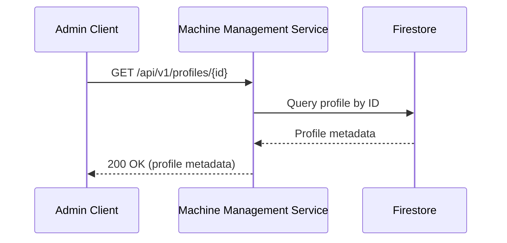

**Path Parameters:**

| Parameter | Type | Required | Description |
|-----------|------|----------|-------------|
| `id` | string | Yes | Boot profile identifier (UUIDv7 format) |

**Response (200 OK):**

```json
{
  "id": "018c7dbd-a000-7000-8000-abcdef123456",
  "kernel": {
    "id": "018c7dbd-b100-7000-8000-123456789abc",
    "args": ["console=tty0", "console=ttyS0", "ip=dhcp"]
  },
  "initrd": {
    "id": "018c7dbd-b200-7000-8000-987654321fed"
  }
}
```

**Error Responses:**

| Status Code | Description |
|-------------|-------------|
| 404 Not Found | Profile with specified ID not found |

---

### `GET /api/v1/profiles/{id}/kernel`

Download the kernel binary for a specific profile.

#### Sequence Diagram

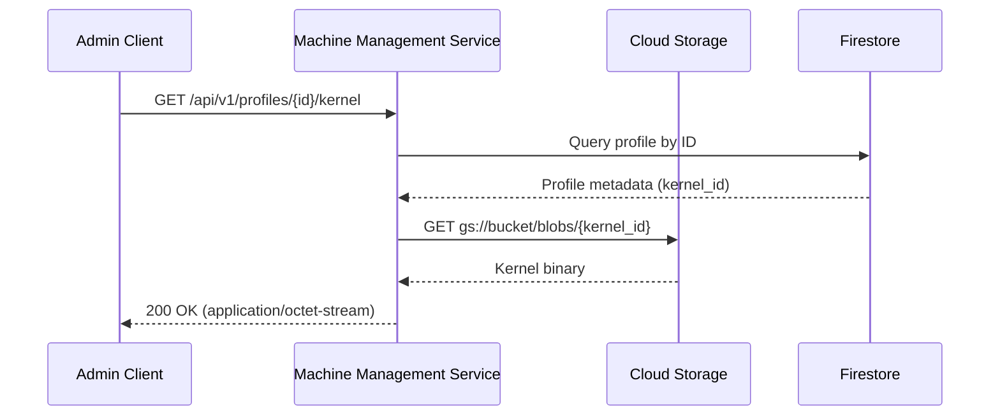

**Path Parameters:**

| Parameter | Type | Required | Description |
|-----------|------|----------|-------------|
| `id` | string | Yes | Boot profile identifier (UUIDv7 format) |

**Response (200 OK):**

- **Content-Type**: `application/octet-stream`
- **Body**: Binary kernel data

**Response Headers:**

```
Content-Type: application/octet-stream
Content-Disposition: attachment; filename="vmlinuz"
```

**Storage Path:**

The kernel is fetched from `gs://{bucket}/blobs/{kernel_id}` where `kernel_id` is the UUIDv7 identifier from the profile.

**Error Responses:**

| Status Code | Description |
|-------------|-------------|
| 404 Not Found | Profile with specified ID not found |

---

### `GET /api/v1/profiles/{id}/initrd`

Download the initrd binary for a specific profile.

#### Sequence Diagram

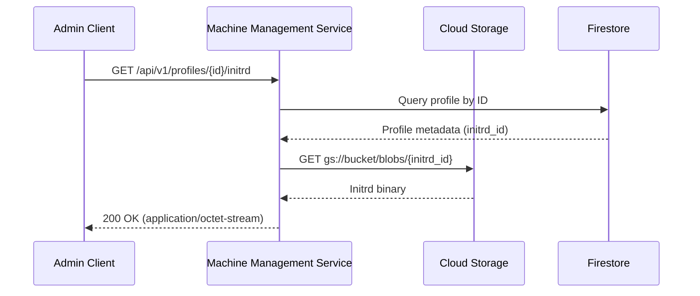

**Path Parameters:**

| Parameter | Type | Required | Description |
|-----------|------|----------|-------------|
| `id` | string | Yes | Boot profile identifier (UUIDv7 format) |

**Response (200 OK):**

- **Content-Type**: `application/octet-stream`
- **Body**: Binary initrd data

**Response Headers:**

```
Content-Type: application/octet-stream
Content-Disposition: attachment; filename="initrd.img"
```

**Storage Path:**

The initrd is fetched from `gs://{bucket}/blobs/{initrd_id}` where `initrd_id` is the UUIDv7 identifier from the profile.

**Error Responses:**

| Status Code | Description |
|-------------|-------------|
| 404 Not Found | Profile with specified ID not found |

---

### `PUT /api/v1/profiles/{id}`

Update a boot profile (creates a new version associated with the machine).

#### Sequence Diagram

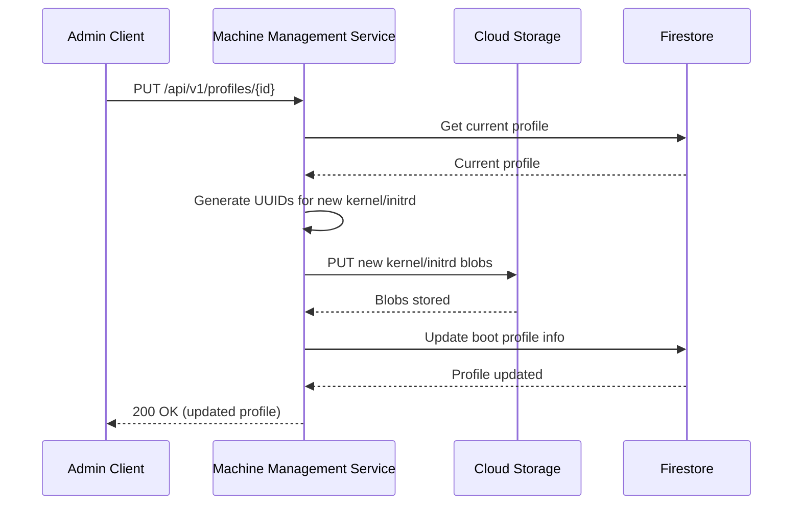

**Path Parameters:**

| Parameter | Type | Required | Description |
|-----------|------|----------|-------------|
| `id` | string | Yes | Boot profile identifier (UUIDv7 format) |

**Request Body (multipart/form-data):**

Same as POST request (machine_id, kernel, initrd, kernel_args).

**Response (200 OK):**

Updated profile metadata.

**Error Responses:**

| Status Code | Description |
|-------------|-------------|
| 404 Not Found | Profile with specified ID not found |
| 422 Unprocessable Entity | Validation error |

---

### `DELETE /api/v1/profiles/{id}`

Delete a boot profile and its associated blobs.

#### Sequence Diagram

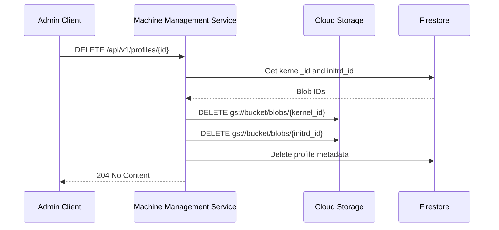

**Path Parameters:**

| Parameter | Type | Required | Description |
|-----------|------|----------|-------------|
| `id` | string | Yes | Boot profile identifier (UUIDv7 format) |

**Response (204 No Content):**

Empty response body.

**Error Responses:**

| Status Code | Description |
|-------------|-------------|
| 404 Not Found | Profile with specified ID not found |

---

## Machine Management

### `POST /api/v1/machines`

Register a new machine with hardware specifications.

#### Sequence Diagram

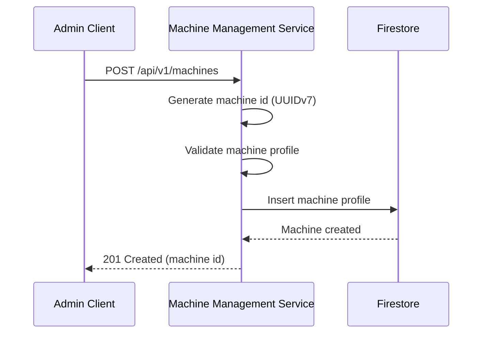

**Request Body:**

```json
{
  "cpus": [
    {
      "manufacturer": "Intel",
      "clock_frequency": 2400000000,
      "cores": 8
    }
  ],
  "memory_modules": [
    {
      "size": 17179869184
    },
    {
      "size": 17179869184
    }
  ],
  "accelerators": [],
  "nics": [
    {
      "mac": "52:54:00:12:34:56"
    }
  ],
  "drives": [
    {
      "capacity": 500107862016
    }
  ]
}
```

**Response (201 Created):**

```json
{
  "id": "018c7dbd-c000-7000-8000-fedcba987654",
  "cpus": [
    {
      "manufacturer": "Intel",
      "clock_frequency": 2400000000,
      "cores": 8
    }
  ],
  "memory_modules": [
    {
      "size": 17179869184
    },
    {
      "size": 17179869184
    }
  ],
  "accelerators": [],
  "nics": [
    {
      "mac": "52:54:00:12:34:56"
    }
  ],
  "drives": [
    {
      "capacity": 500107862016
    }
  ]
}
```

**Error Responses:**

| Status Code | Description |
|-------------|-------------|
| 400 Bad Request | Invalid request body or missing required fields |
| 409 Conflict | Machine with the same NIC MAC address already exists |

**Notes:**

- The machine ID is generated server-side (UUIDv7)
- MAC addresses must be unique across all machines
- All size/capacity values are in bytes
- Clock frequency is in hertz

---

### `GET /api/v1/machines`

List all registered machines.

#### Sequence Diagram

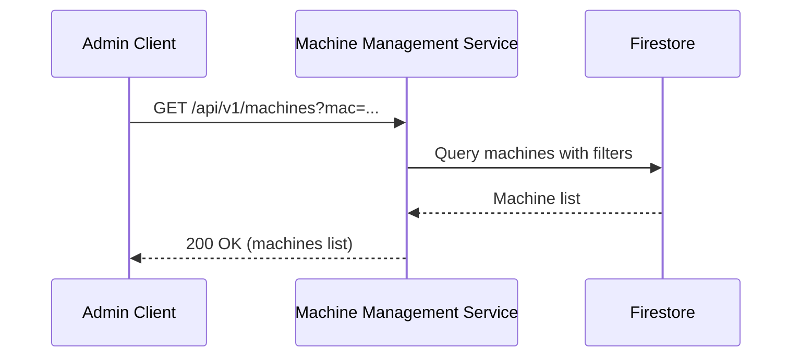

**Query Parameters:**

| Parameter | Type | Required | Description | Default |
|-----------|------|----------|-------------|---------|
| `page` | integer | No | Page number (1-indexed) | 1 |
| `per_page` | integer | No | Results per page (1-100) | 20 |
| `mac` | string | No | Filter by NIC MAC address | - |

**Response (200 OK):**

```json
{
  "machines": [
    {
      "id": "018c7dbd-c000-7000-8000-fedcba987654",
      "cpus": [
        {
          "manufacturer": "Intel",
          "clock_frequency": 2400000000,
          "cores": 8
        }
      ],
      "memory_modules": [
        {
          "size": 17179869184
        }
      ],
      "accelerators": [],
      "nics": [
        {
          "mac": "52:54:00:12:34:56"
        }
      ],
      "drives": [
        {
          "capacity": 500107862016
        }
      ]
    }
  ],
  "pagination": {
    "total": 1,
    "page": 1,
    "per_page": 20,
    "total_pages": 1
  }
}
```

---

### `GET /api/v1/machines/{id}`

Retrieve a specific machine by ID.

#### Sequence Diagram

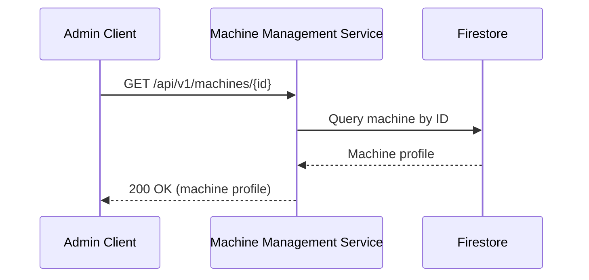

**Path Parameters:**

| Parameter | Type | Required | Description |
|-----------|------|----------|-------------|
| `id` | string | Yes | Machine identifier (UUIDv7 format) |

**Response (200 OK):**

Same as POST response.

**Error Responses:**

| Status Code | Description |
|-------------|-------------|
| 404 Not Found | Machine with specified ID not found |

---

### `PUT /api/v1/machines/{id}`

Update a machine's hardware profile.

#### Sequence Diagram

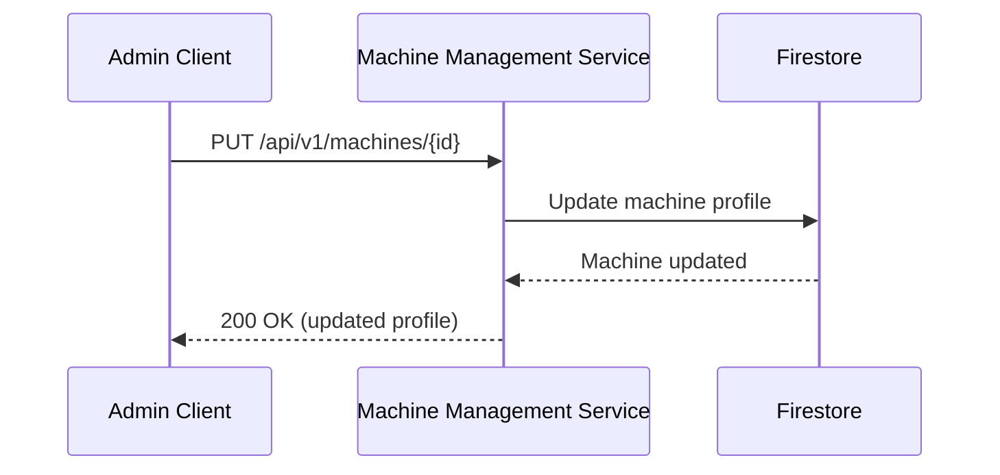

**Path Parameters:**

| Parameter | Type | Required | Description |
|-----------|------|----------|-------------|
| `id` | string | Yes | Machine identifier (UUIDv7 format) |

**Request Body:**

Full machine profile (same as POST request).

**Response (200 OK):**

Full machine profile with updated fields.

**Error Responses:**

| Status Code | Description |
|-------------|-------------|
| 404 Not Found | Machine with specified ID not found |
| 400 Bad Request | Invalid request body |

---

### `DELETE /api/v1/machines/{id}`

Delete a machine registration.

#### Sequence Diagram

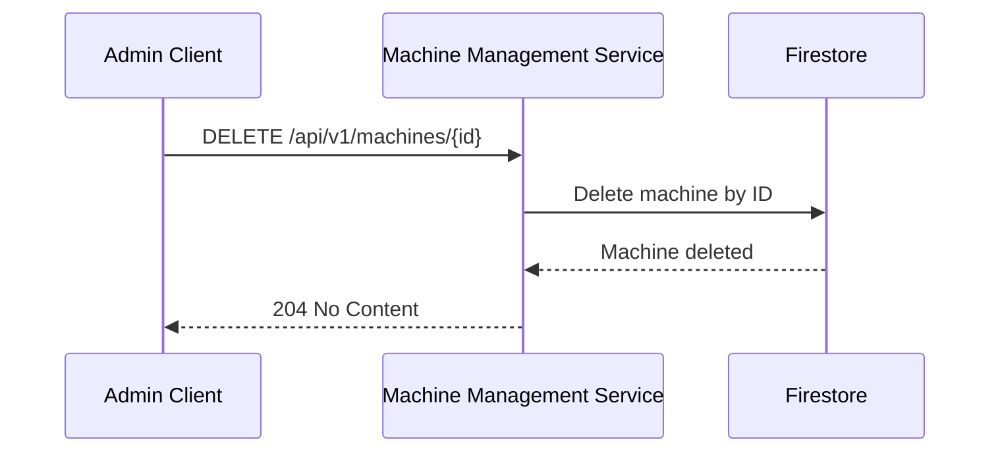

**Path Parameters:**

| Parameter | Type | Required | Description |
|-----------|------|----------|-------------|
| `id` | string | Yes | Machine identifier (UUIDv7 format) |

**Response (204 No Content):**

Empty response body.

**Error Responses:**

| Status Code | Description |
|-------------|-------------|
| 404 Not Found | Machine with specified ID not found |

---

## Boot Profile Management

All data models are defined as Protocol Buffer (protobuf) messages and stored in Firestore.

### Boot Profile

```protobuf
syntax = "proto3";

message Kernel {
  string id = 1;              // UUIDv7 blob identifier
  repeated string args = 2;   // Kernel command-line arguments
}

message Initrd {
  string id = 1;              // UUIDv7 blob identifier
}

message BootProfile {
  string id = 1;              // UUIDv7 identifier
  Kernel kernel = 2;          // Kernel configuration
  Initrd initrd = 3;          // Initrd configuration
}
```

### Machine

```protobuf
syntax = "proto3";

message CPU {
  string manufacturer = 1;
  int64 clock_frequency = 2;  // measured in hertz
  int64 cores = 3;            // number of cores
}

message MemoryModule {
  int64 size = 1;             // measured in bytes
}

message Accelerator {
  string manufacturer = 1;
}

message NIC {
  string mac = 1;             // mac address
}

message Drive {
  int64 capacity = 1;         // capacity in bytes
}

message Machine {
  string id = 1;              // UUIDv7 machine identifier
  repeated CPU cpus = 2;
  repeated MemoryModule memory_modules = 3;
  repeated Accelerator accelerators = 4;
  repeated NIC nics = 5;
  repeated Drive drives = 6;
}
```

---

## Rate Limiting

Admin API endpoints are rate-limited to prevent abuse:

- **Per User/Service Account**: 100 requests/minute
- **Per IP Address**: 300 requests/minute
- **Global**: 1000 requests/minute

Rate limit headers are included in responses:

```
X-RateLimit-Limit: 100
X-RateLimit-Remaining: 95
X-RateLimit-Reset: 1700000000
```

When rate limit is exceeded, API returns `429 Too Many Requests`:

```json
{
  "error": {
    "code": "RATE_LIMIT_EXCEEDED",
    "message": "Rate limit exceeded. Try again in 30 seconds.",
    "details": {
      "retry_after": 30
    }
  }
}
```

---

## Versioning

The Admin API uses URL versioning (`/api/v1/`):

- **Current Version**: v1
- **Deprecation Policy**: Minimum 6 months notice before version deprecation
- **Version Header**: `X-API-Version: v1` included in all responses
