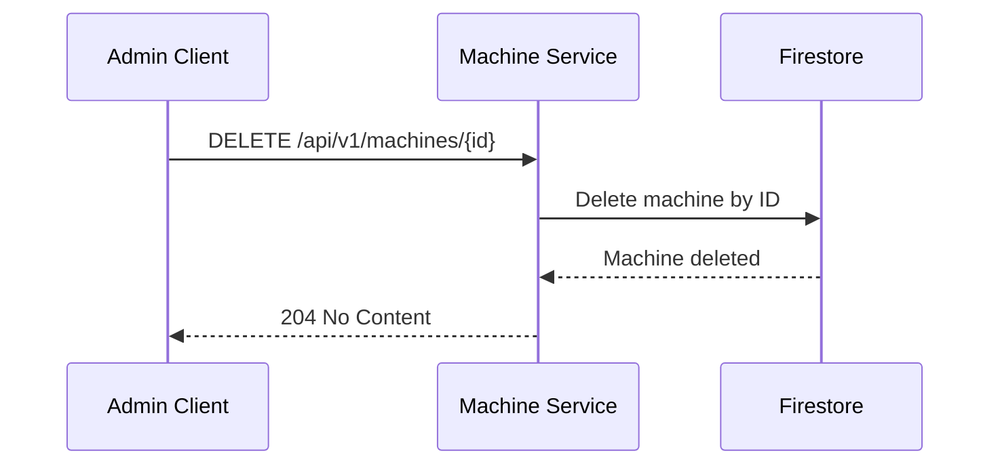

Delete a machine registration.

## Sequence Diagram



## Request

**Path Parameters:**

| Parameter | Type | Required | Description |
|-----------|------|----------|-------------|
| `id` | string | Yes | Machine identifier (UUIDv7 format) |

**Example Request:**

```http
DELETE /api/v1/machines/018c7dbd-c000-7000-8000-fedcba987654 HTTP/1.1
Host: machine.example.com
```

## Response

**Response (204 No Content):**

Empty response body.

**Error Responses:**

All error responses follow RFC 7807 Problem Details format (see [ADR-0007](../../adrs/0007-standard-api-error-response/)) with `Content-Type: application/problem+json`.

**404 Not Found** - Machine with specified ID not found:

```json
{
  "type": "https://api.example.com/errors/machine-not-found",
  "title": "Machine Not Found",
  "status": 404,
  "detail": "Machine with ID 018c7dbd-c000-7000-8000-fedcba987654 not found",
  "instance": "/api/v1/machines/018c7dbd-c000-7000-8000-fedcba987654",
  "machine_id": "018c7dbd-c000-7000-8000-fedcba987654"
}
```
