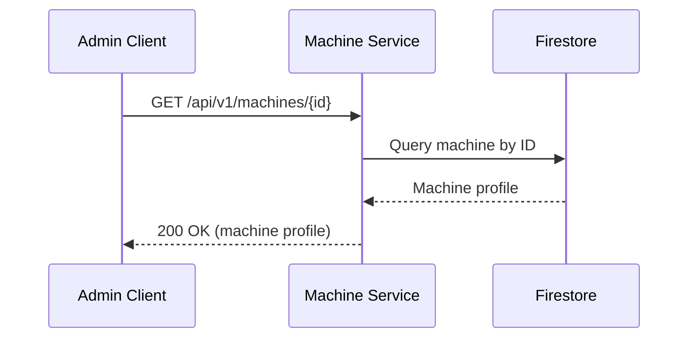

Retrieve a specific machine by ID.

## Sequence Diagram



## Request

**Path Parameters:**

| Parameter | Type | Required | Description |
|-----------|------|----------|-------------|
| `id` | string | Yes | Machine identifier (UUIDv7 format) |

**Example Request:**

```http
GET /api/v1/machines/018c7dbd-c000-7000-8000-fedcba987654 HTTP/1.1
Host: machine.example.com
```

## Response

**Response (200 OK):**

```json
{
  "id": "018c7dbd-c000-7000-8000-fedcba987654",
  "cpus": [
    {
      "manufacturer": "Intel",
      "clock_frequency": 2400000000,
      "cores": 8
    }
  ],
  "memory_modules": [
    {
      "size": 17179869184
    },
    {
      "size": 17179869184
    }
  ],
  "accelerators": [],
  "nics": [
    {
      "mac": "52:54:00:12:34:56"
    }
  ],
  "drives": [
    {
      "capacity": 500107862016
    }
  ]
}
```

**Error Responses:**

| Status Code | Description |
|-------------|-------------|
| 404 Not Found | Machine with specified ID not found |
