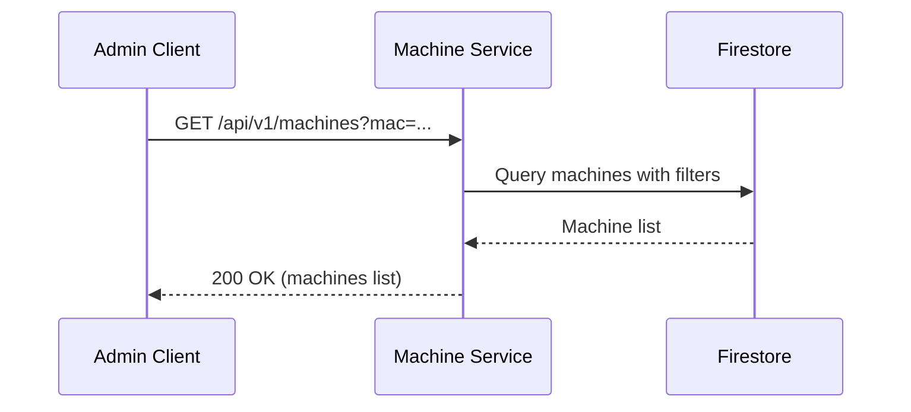

List all registered machines with optional filtering by MAC address.

## Sequence Diagram



## Request

**Query Parameters:**

| Parameter | Type | Required | Description | Default |
|-----------|------|----------|-------------|---------|
| `page` | integer | No | Page number (1-indexed) | 1 |
| `per_page` | integer | No | Results per page (1-100) | 20 |
| `mac` | string | No | Filter by NIC MAC address | - |

**Example Request:**

```http
GET /api/v1/machines?page=1&per_page=20 HTTP/1.1
Host: machine.example.com
```

**Example Request with MAC filter:**

```http
GET /api/v1/machines?mac=52:54:00:12:34:56 HTTP/1.1
Host: machine.example.com
```

## Response

**Response (200 OK):**

```json
{
  "machines": [
    {
      "id": "018c7dbd-c000-7000-8000-fedcba987654",
      "cpus": [
        {
          "manufacturer": "Intel",
          "clock_frequency": 2400000000,
          "cores": 8
        }
      ],
      "memory_modules": [
        {
          "size": 17179869184
        }
      ],
      "accelerators": [],
      "nics": [
        {
          "mac": "52:54:00:12:34:56"
        }
      ],
      "drives": [
        {
          "capacity": 500107862016
        }
      ]
    }
  ],
  "pagination": {
    "total": 1,
    "page": 1,
    "per_page": 20,
    "total_pages": 1
  }
}
```
