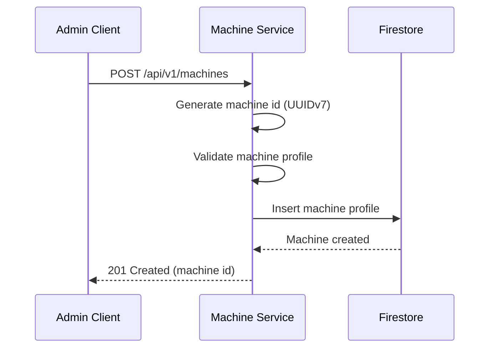

Register a new machine with hardware specifications.

## Sequence Diagram



## Request

**Request Body:**

```json
{
  "cpus": [
    {
      "manufacturer": "Intel",
      "clock_frequency": 2400000000,
      "cores": 8
    }
  ],
  "memory_modules": [
    {
      "size": 17179869184
    },
    {
      "size": 17179869184
    }
  ],
  "accelerators": [],
  "nics": [
    {
      "mac": "52:54:00:12:34:56"
    }
  ],
  "drives": [
    {
      "capacity": 500107862016
    }
  ]
}
```

## Response

**Response (201 Created):**

```json
{
  "id": "018c7dbd-c000-7000-8000-fedcba987654",
  "cpus": [
    {
      "manufacturer": "Intel",
      "clock_frequency": 2400000000,
      "cores": 8
    }
  ],
  "memory_modules": [
    {
      "size": 17179869184
    },
    {
      "size": 17179869184
    }
  ],
  "accelerators": [],
  "nics": [
    {
      "mac": "52:54:00:12:34:56"
    }
  ],
  "drives": [
    {
      "capacity": 500107862016
    }
  ]
}
```

**Error Responses:**

| Status Code | Description |
|-------------|-------------|
| 400 Bad Request | Invalid request body or missing required fields |
| 409 Conflict | Machine with the same NIC MAC address already exists |

## Notes

- The machine ID is generated server-side (UUIDv7)
- MAC addresses must be unique across all machines
- All size/capacity values are in bytes
- Clock frequency is in hertz

## Data Models

All data models are defined as Protocol Buffer (protobuf) messages and stored in Firestore.

### Machine

```protobuf
syntax = "proto3";

message CPU {
  string manufacturer = 1;
  int64 clock_frequency = 2;  // measured in hertz
  int64 cores = 3;            // number of cores
}

message MemoryModule {
  int64 size = 1;             // measured in bytes
}

message Accelerator {
  string manufacturer = 1;
}

message NIC {
  string mac = 1;             // mac address
}

message Drive {
  int64 capacity = 1;         // capacity in bytes
}

message Machine {
  string id = 1;              // UUIDv7 machine identifier
  repeated CPU cpus = 2;
  repeated MemoryModule memory_modules = 3;
  repeated Accelerator accelerators = 4;
  repeated NIC nics = 5;
  repeated Drive drives = 6;
}
```
