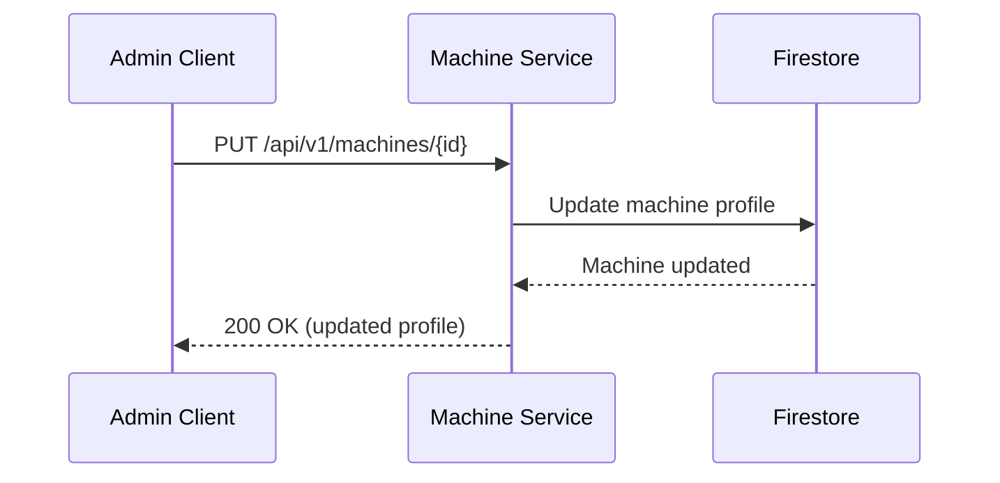

Update a machine's hardware profile.

## Sequence Diagram



## Request

**Path Parameters:**

| Parameter | Type | Required | Description |
|-----------|------|----------|-------------|
| `id` | string | Yes | Machine identifier (UUIDv7 format) |

**Request Body:**

Full machine profile (same structure as POST /api/v1/machines):

```json
{
  "cpus": [
    {
      "manufacturer": "Intel",
      "clock_frequency": 2400000000,
      "cores": 8
    }
  ],
  "memory_modules": [
    {
      "size": 17179869184
    },
    {
      "size": 17179869184
    }
  ],
  "accelerators": [],
  "nics": [
    {
      "mac": "52:54:00:12:34:56"
    }
  ],
  "drives": [
    {
      "capacity": 500107862016
    }
  ]
}
```

## Response

**Response (200 OK):**

Full machine profile with updated fields:

```json
{
  "id": "018c7dbd-c000-7000-8000-fedcba987654",
  "cpus": [
    {
      "manufacturer": "Intel",
      "clock_frequency": 2400000000,
      "cores": 8
    }
  ],
  "memory_modules": [
    {
      "size": 17179869184
    },
    {
      "size": 17179869184
    }
  ],
  "accelerators": [],
  "nics": [
    {
      "mac": "52:54:00:12:34:56"
    }
  ],
  "drives": [
    {
      "capacity": 500107862016
    }
  ]
}
```

**Error Responses:**

All error responses follow RFC 7807 Problem Details format (see [ADR-0007](../../adrs/0007-standard-api-error-response/)) with `Content-Type: application/problem+json`.

**400 Bad Request** - Invalid request body:

```json
{
  "type": "https://api.example.com/errors/validation-error",
  "title": "Validation Error",
  "status": 400,
  "detail": "The request body failed validation",
  "instance": "/api/v1/machines/018c7dbd-c000-7000-8000-fedcba987654",
  "invalid_fields": [
    {
      "field": "nics",
      "reason": "at least one NIC is required"
    }
  ]
}
```

**404 Not Found** - Machine with specified ID not found:

```json
{
  "type": "https://api.example.com/errors/machine-not-found",
  "title": "Machine Not Found",
  "status": 404,
  "detail": "Machine with ID 018c7dbd-c000-7000-8000-fedcba987654 not found",
  "instance": "/api/v1/machines/018c7dbd-c000-7000-8000-fedcba987654",
  "machine_id": "018c7dbd-c000-7000-8000-fedcba987654"
}
```
